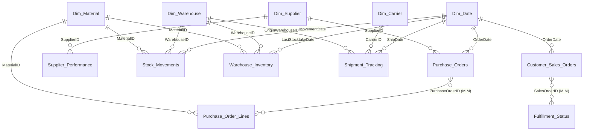

# 📦 Supply Chain Analytics — Power BI

**A production-grade Power BI semantic model built from raw, messy CSV exports to a governed, secured, decision-ready analytics solution — end to end, from data quality triage to row-level security.**

Supply chain leadership had no unified view connecting purchasing, supplier reliability, inventory, and fulfillment — five operational areas living in separate spreadsheets, with no shared time dimension and no way to answer "where exactly is the bottleneck?" This project turns 12 raw datasets into one star-schema model that answers that question directly.


---

## 📊 Project at a Glance

| | | |
|---|---|---|
| **~180,000** records modeled | **12** source datasets unified | **8** fact + **5** dimension tables |
| **30** curated DAX measures | **19** relationships (incl. 2 M:M by design) | **4** drill-down hierarchies |
| **3** Row-Level Security roles | **5-year** date dimension (2022–2026) | **5** business domains covered |

---

## 🎯 Business Problem

| Business question | Answered by |
|---|---|
| Are suppliers delivering on time and at quality? | `Avg On-Time Delivery Rate`, `Avg Supplier Quality Score`, `Avg Supplier Lead Time (Days)` |
| Where are the delivery bottlenecks? | `Delayed Shipment Rate` — headline KPI for this problem |
| What's our current inventory position? | `Total Quantity On Hand`, `Total Stock Movement Quantity` |
| How efficiently are we fulfilling customer orders? | `Order Fulfillment Rate` + full YTD/QTD/MTD/YoY tracking |
| Is procurement spend trending up or down? | `Total Purchase Order Value` + full Time Intelligence layer |

---

## 🧠 Skills Demonstrated

- **Dimensional modeling** — Kimball-style star schema design, with documented reasoning for every fact/dimension classification
- **Data quality engineering** — Power Query (M) transformations to trim, standardize, and type-correct messy source data without silently discarding ambiguous records
- **Advanced DAX** — time intelligence, iterators, variables, role-playing dimensions, percentage-point vs. percent-of-percent calculations
- **Security design** — dynamic Row-Level Security scoped by supplier and warehouse
- **Performance optimization** — VertiPaq-aware data typing (fixed-decimal Currency vs. floating Double), attribute hierarchy tuning
- **Technical writing** — full model documentation, executive-level reporting, and this README, tailored to three different audiences

---

## 🏗️ Architecture

Built as a **star schema** — 5 dimension tables and 8 fact tables — with a single shared Date dimension driving consistent time intelligence across every business area.



**Dimension tables:** Dim_Supplier, Dim_Warehouse, Dim_Material, Dim_Carrier, Dim_Date (2022–2026)
**Fact tables:** Purchase_Orders, Purchase_Order_Lines, Supplier_Performance, Customer_Sales_Orders, Fulfillment_Status, Shipment_Tracking, Stock_Movements, Warehouse_Inventory

Two relationships are deliberately **Many-to-Many** rather than the textbook One-to-Many — a conscious trade-off explained below, not an oversight.

---

## ✨ Key Features

- **30 curated DAX measures** across 5 business domains (Purchasing, Supplier Performance, Sales & Fulfillment, Logistics & Shipping, Inventory & Warehouse) plus a focused **Time Intelligence** layer (YTD, YoY growth, rolling 3-month averages) for the three most critical metrics
- **4 drill-down hierarchies** — Year → Quarter → Month → Day, Country → Supplier, Location → Warehouse, Category → Material
- **Row-Level Security** with 3 roles: full-access Supply Chain Manager, supplier-scoped Supplier View, and warehouse-scoped Warehouse Manager
- **Data type optimization** for VertiPaq compression — fixed-decimal Currency types for monetary columns instead of floating-point doubles, `IsAvailableInMDX` disabled on hidden foreign keys
- **Transparent data quality framework** — every fact table carries a `DuplicateFlag` (Unique / Duplicate / Missing Key) so conflicting records are flagged and excluded from KPIs, never silently deleted

---

## 📊 Sample DAX

A few measures that show the modeling approach — full catalog of all 30 is in [`docs/Technical_Reference.md`](docs/Technical_Reference.md).

```dax
-- Core KPI: the headline bottleneck metric for this business problem
Delayed Shipment Rate =
DIVIDE([Shipments Delayed], [Total Shipments])

-- Every core measure filters out flagged conflicting records
Total Purchase Order Value =
CALCULATE(
    SUM('Purchase_Orders'[TotalCost]),
    'Purchase_Orders'[DuplicateFlag] = "Unique"
)

-- Percentage-point (not percent-of-a-percent) YoY change for rate-type metrics
Order Fulfillment Rate YoY Growth % =
VAR Curr = [Order Fulfillment Rate]
VAR Prior = [Order Fulfillment Rate SPLY]
RETURN Curr - Prior

-- Blended (not simple-averaged) rolling rate, to avoid misweighting
-- months with different order volumes
Order Fulfillment Rate Rolling 3M Avg =
VAR CurrentDate = MAX('Dim_Date'[Date])
VAR Last3M = DATESINPERIOD('Dim_Date'[Date], CurrentDate, -3, MONTH)
RETURN CALCULATE([Order Fulfillment Rate], Last3M)
```

---

## 🧹 Data Quality Methodology

Source data arrived with inconsistent formatting, `"#N/A"` placeholder text, and genuine record-level conflicts. The cleanup approach prioritized **transparency over silent correction**:

1. Trimmed whitespace and standardized null representation across every text column
2. Corrected data types (text → proper Date/Currency) that had been masked by placeholder values
3. Removed rows with a genuinely missing primary key (no information to preserve)
4. **Flagged, but did not delete**, rows sharing a primary key with conflicting data — visible via `DuplicateFlag`, counted in a dedicated Data Quality measure folder, excluded from core KPIs by default

That last decision is why `Purchase_Orders ↔ Purchase_Order_Lines` and `Customer_Sales_Orders ↔ Fulfillment_Status` are Many-to-Many relationships rather than clean One-to-Many — the alternative would have meant silently discarding potentially-real business records to force a textbook schema shape. This is the kind of judgment call that matters more in a real analytics job than getting every relationship to look "clean" on paper.

---

## 🔐 Row-Level Security

| Role | Access |
|---|---|
| Supply Chain Manager | Full, unrestricted access |
| Supplier View | `Dim_Supplier[SupplierName] = USERPRINCIPALNAME()` — restricted to one supplier's own data |
| Warehouse Manager | `Dim_Warehouse[WarehouseName] = USERPRINCIPALNAME()` — restricted to one warehouse's own data |

Filtering a dimension table automatically cascades to every related fact table, since all fact-to-dimension relationships filter single-direction — no need to secure each fact table individually.

---

## 📁 Repository Structure

```
├── Supply chain project end to end.pbix   # Power BI Desktop file
├── docs/
│   ├── Executive_Summary.md               # 5-page leadership-facing overview
│   └── Technical_Reference.md             # Full data dictionary, 30 curated DAX formulas, relationship map
└── README.md
```

---

## 🛠️ Tech Stack

- **Power BI Desktop** — semantic modeling, DAX, Power Query (M)
- **Power BI Modeling MCP Server** — programmatic model editing (relationships, measures, RLS, hierarchies) connected live to Power BI Desktop
- **Claude (Anthropic)** — AI-assisted development workflow for model design, DAX authoring, and documentation
- **VS Code** — DAX/M scripting and project file management
- **Star schema design** — Kimball-style dimensional modeling
- **DAX** — time intelligence, iterators, variables, role-playing dimensions
- **Row-Level Security** — dynamic, `USERPRINCIPALNAME()`-based

---

## 👤 Author

**Isha** — Business Intelligence Analyst
---
Built as an end-to-end demonstration of data cleaning, dimensional modeling, DAX, security design, and stakeholder-appropriate documentation.
